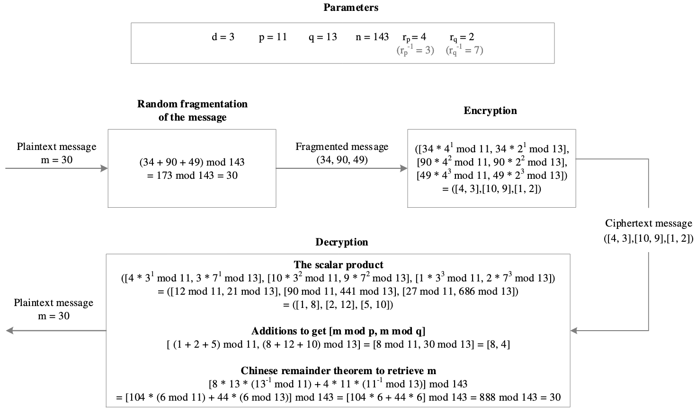
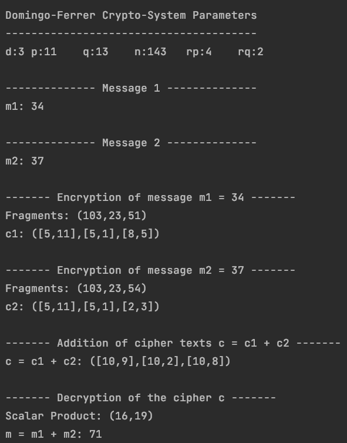

# DOMINGO-FERRER HOMOMORPHIC ENCRYPTION
> *Implementation of Domingo-Ferrer homomorphic crypto-system in C program.*

### 1. Introduction to Homomorphic Encryption

A homomorphic encryption scheme makes possible to perform the arithmetic operations on the encrypted data without decrypting them. Homomorphic encryption also reduces the processing time of initially encrypted data. Homomorphic encryption in the cloud computing ensures data confidentiality and minimizes the risk of attacks. By applying a homomorphic encryption scheme in a system, it can avoid the risk that can occur when exchanging the secret keys.

By definition, we have a homomorphic encryption if from Enc(m1) and Enc(m2) it is possible to compute Enc(f(m1,m2)), where f can be +, x or ⊕ and without using the secret key. According to the operations that allow to access on raw data, we distinguish three types of homomorphic encryption:

- A homomorphic encryption is said to be **additive** *(e.g.: Pailler’s crypto-system)*, if Enc(m1+m2) = Enc(m1)·Enc(m2).
- A homomorphic encryption is said to be **multiplicative** *(e.g.: RSA crypto-system)*, if Enc(m1·m2) = Enc(m1)·Enc(m2).
- A homomorphic encryption is said to be **fully** *(DGHV crypto-system)*, if it is at time additively and multiplicatively homomorphic.

### 2. Domingo-Ferrer's Crypto-System

In Domingo-Ferrer’s cryptosystem, the size of parameter ***d*** affects the size of ciphertext. Domingo-Ferrer’s encryption algorithm is a symmetric-key based cryptosystem uses two secret parameters ***rp*** and ***rq*** for encryption and computes ***rp-1*** and ***rq-1*** for corresponding decryption. Drastically reducing the size of the parameter ***d*** could attenuate the effect of exponentiation for not having very wide cryptogram.

- ##### 2.1 Encryption
 + This encryption algorithm begins with the choice of two prime numbers ***p*** and ***q*** and from them, we could easily calculate ***n = p * q***. These parameters (***p***, ***q***, ***rp*** and ***rq***) should be kept as secret key. The parameter ***d*** must be *greater or equal* to 2.
 + Then choose randomly ***rp*** and ***rq*** belonging to the multiplicative subgroup ***Zp**** and ***Zq**** respectively.
 + Before the encryption process, it is necessary to split randomly the message ***m*** into different integers ***m1***, ***m2***, ..., ***md*** such that ***∑ mi = m mod n*** and ***mi ∈ Zn***, where ***i ∈ {1, 2, …, d}***. The ciphertext is obtained by computing: ***Ek(m) = ([m1 * rp1 mod p, m1 * rq1 mod q], [m2 * rp2 mod p, m2 * rq2 mod q], …, [md * rpd mod p, md * rqd mod q])***.

- ##### 2.2 Decryption
 To decrypt, compute the scalar product of the ***ith [mod p, mod q]*** pair by ***[rp-i mod p, rq-i mod q]*** to retrieve the ***[mi mod p, mi mod q]***. Add up to get ***[m mod p, m mod q]***. Use the *Chinese remainder theorem* to obtain the unique ***m mod n***.

- ##### 2.3 Example

### 3. Example of Implementation in C Programming

Clone the project and execute the main function. Change default parameters and values for your own tests.

> Example of output:
>
> 
